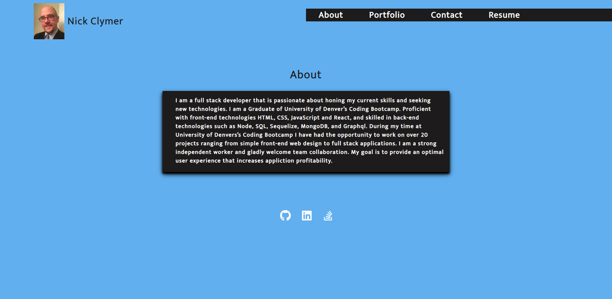

  # React Portfolio
  
  # Table of Contents
  
  - [Description](#Description)
  - [How to install](#Installation)
  - [How to use this app](#Usage)
  - [Licence info](#Licence)
  - [Contributors](#Contributors)
  - [Testing](#Testing)
  - [Questions](#Questions)
  
  ## Description:
  

    This project is designed to showcase my portfolio to potential employers.

  ## Installation:
    Please visit the URL listed below for github pages deployment.

  ## Usage:
    It is a simple click navigation app that allows users to view deployed projects and contact me.

  ## Licence:
  NOTICE! - This application has the following licence type: 

  Please visit https://opensource.org/licenses/ for more information.

  ## Contributors:
    nick clymer

  ## Testing:
    no
    
  ## Questions:
  The repository for this application can be found at: https://github.com/ncclymer

  Deployed github pages link: https://ncclymer.github.io/20-my-react-portfolio/

  You can also reach me directly at: nick_clymer2018@yahoo.com
  
  Screen shot : 
  
